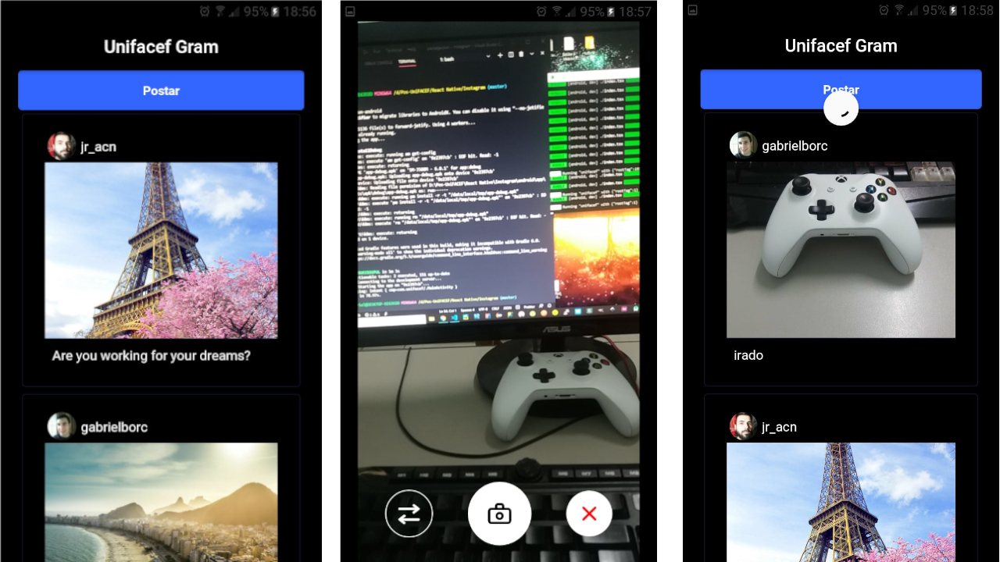

# Instagram Fake
[Versão com TypeScript]



## Conteúdo

- [Instalação](#instalação)
- [Modo de uso](#modo-de-uso)

## Instalação

### Requisitos

- NodeJS(https://nodejs.org/pt-br/)
- Yarn(https://yarnpkg.com/)
- React Native(https://reactnative.dev/)

### Clone

Clone este repositório em sua máquina local usando `https://github.com/gabrielborc/instagram-fake`

### Configuração

Dentro da pasta raiz do projeto execute o comando abaixo para instalar as dependências:

```
$ yarn install
```

## Modo de uso

Após seguir os passos de [instalação](#instalação), o primeiro passo é excutar a api fake, na raiz do projeto execute o comando abaixo:

```
yarn json-server server.json -d 1000 -w
```

Agora vamos disponibilizar o celular ou o emulador de acessar o seu localhost:

```
adb reverse tcp:3000 tcp:3000
```

Execute o projeto usando o comando abaixo na pasta raiz do projeto:

```
$ yarn android
```
